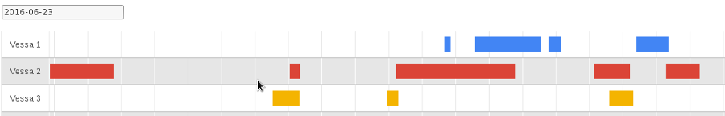

### Anonyymin käyttäytymistiedon aarreaitta

Vapauskarttojen sivutuotteena kertyy runsaasti dataa, jota voi käyttää
resurssien riittävyyden ja kuormituksen pitkäjänteiseen analysointiin.
Kerätyn aineiston avulla voidaan vastata tarkasti ja objektiivisesti
moniin kysymyksiin:

* Mihin ruuhkahuiput sijoittuvat?
* Mikä on tyypillinen jonotusaika?
* Kannattaako resurssin vapautumista jäädä odottamaan?
* Jos resursseihin investoidaan lisää, riittävätkö saavutetut
  aikasäästöt kattamaan kustannukset?

Analyysin tuloksena voidaan arvioida mahdollisia toimenpiteitä
resurssien kuormituksen tasoittamiseksi tai saatavuuden lisäämiseksi.
Toisaalta alikäytettyjen resurssien käytöstä poistaminen helpottuu, kun
päätöksenteon tukena on luotettavia tilastoja.

Koska vapauskartta-aineistot ovat anonyymeja, niiden käyttöön ei
juurikaan liity eettisiä ongelmia.  Ne ovat siis ihmisten käyttäytymistä
tarkasti kuvaava tiedonlähde, jonka tieteellinen ja kaupallinen käyttö
on varsin ongelmatonta.

### Avoimet rajapinnat

VVK-palvelun rajapinnat ovat avoimia REST-rajapintoja, joista aineistot
saa helposti JSON-muodossa omaan käyttöön.  Et ole siis sidottu tähän
yhteen palveluun, vaan tietosi pysyvät sinun hallinnassasi.
[Esimerkkikartan APIa](https://secret-oasis-98680.herokuapp.com/swagger-ui.html)
voi selailla verkossa.

### Vapauskarttojen vaikuttavuuden arviointi

VVK-vapauskarttojen käyttöönotto kannattaa aloittaa seurantavaiheella,
jossa tiedonkeruu antureilla käynnistetään, mutta vapaustietoa ei vielä
jaeta käyttäjille. Näin voidaan mitata, kuinka suuri parannus
saavutetaan esimerkiksi käyttöasteissa tai jonotusajoissa järjestelmän
käyttöönoton myötä. Tiedonkeruuvaiheen on hyvä kestää 1–2 viikkoa, jotta
lähtötilanteesta saadaan riittävän tarkka kuva.

### Esimerkkiaineisto ladattavaksi

VVK-vapauskartan pilotti Solitan Helsingin-toimistolla on tuottanut jo
nyt paljon aineistoa, josta [esimerkki](toilets.csv) on vapaasti
ladattavissa (CSV).  Aineisto koostuu anturien lähettämistä
tapahtumista, joihin liittyy anturityyppi ja mittausarvo.  Tämä on
käyttömahdollisuuksiltaan monipuolista ns. raakadataa eli mahdollisimman
muuntamatonta lähtödataa.  VVK-palvelua varten tästä raakadatasta on
tulkittu eri paikkojen (aineistossa place_id) varaustilanne.

