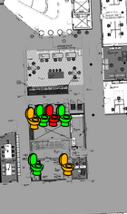

### Kuinka paljon teillä menee päivittäin aikaa kiertelyyn?

 <a href="http://koneidenkapinaadele.github.io/vvk-ui/">
  
 <small>Esimerkki vapauskartasta (klikkaamalla pääset reaaliaikaiseen)</small>
 </a>

Vapaat työpisteet, hiljaiset tilat, tulostimet, kahviautomaatit,
vessat, puhelinkopit tai parkkipaikat - näillä kaikilla on yhteinen
piirre: niistä on joskus pulaa.  Ja kun jostain on pulaa, se aiheuttaa
jonoja, turhaa kiertelyä, ajanhukkaa ja ärtymystä.

Vapauskartat ovat reaaliaikaisesti päivittyviä karttoja, jotka
kertovat lähistön todellisen varaustilanteen.  Ne eivät perustu
luulotteluun eivätkä erikseen tehtäviin ennakkovarauksiin, vaan kertovat
vallitsevan tilanteen täsmälleen sellaisena, kuin se on.  Varaustieto
kerätään reaaliaikaisesti antureilla tai muusta varaustietolähteestä,
kuten parkkimaksujärjestelmästä.

### Kenelle VVK-vapauskartta on suunnattu?

VVK-palveluita rakennetaan työpaikoille, oppilaitoksille,
yleisöpalveluihin ja muihin paikkoihin, joissa yksi taho hallinnoi
suuren ihmisjoukon yhteiskäyttöisiä välineitä tai tiloja.  Toinen
tilaajatyyppi voisi olla saman alueen palveluntarjoajien yhteenliittymä,
jos esimerkiksi lounasravintolat pääsevät yhteisymmärrykseen
vapauskartasta, joka kertoo alueen lounasravintoloiden täyttöasteen
kullakin ajanhetkellä.

VVK-palvelun [ohjelmistokomponentit](teknologia) ovat [avointa
lähdekoodia](https://github.com/KoneidenKapinaAdele/vvk-back), joten
palvelun voi ottaa koekäyttöön pienellä taloudellisella riskillä ja jopa
omatoimisesti.  Tiedonkeruun asennuksiin ja ylläpitoon sekä kertyneen
varausaineiston jatkohyödyntämiseen on saatavilla maksullista tukea.

### Kannattaako vapauskartta ottaa käyttöön meidän tiloissamme?

Joissakin paikoissa ei ole minkäänlaisia tukkeutumisongelmia: kaikkia
yhteiskäyttöisiä resursseja on yllin kyllin.  Jos pullonkauloja alkaa
kuitenkin muodostua, vapauskartta on sekä halvempi että
miellyttävämmäksi koettu kuin vaihtoehdot:

- Jos tilanteelle ei tehdä mitään, aikaa ja vaivaa tuhrautuu vapaiden
  resurssien etsimiseen.  Lisäksi on näkymätöntä töiden hidastumista,
  kun käyttäjät ennakoivat (usein tiedostamattaan) varaustilannetta: "ei
  sinne kumminkaan kannata mennä vielä, kun siellä on niin iso jono..."
  Vapauskartta sen sijaan kertoo ihmisille välittömästi, tarvitseeko
  jonottaa vai ei.

- Jos yhteiskäyttöisiä resursseja rakennetaan lisää, se tulee usein
  kalliiksi, ja lisäksi uudet laitteet/tilat täytyy sijoittaa johonkin
  uuteen paikkaan.  Koska kaikki järkevät paikat ovat yleensä jo
  käytössä, uudet sijoittuvat kauas ja käyttäjien kannalta
  epäkäytännöllisiin paikkoihin.

- Jos vapauskartan sijaan tehdään varausjärjestelmä (kuten usein
  neuvotteluhuoneille), tukkeutumistilanne usein *pahenee*, kun
  ihmiset ennakkovaraavat resurssit yli tarpeen - jotteivät jäisi ilman.
  Reaaliaikainen vapauskartta sen sijaan ohjaa käyttäjät luonnostaan
  välittömästi oikeasti vapaille paikoille ja maksimoi niiden
  hyötykäytön.

