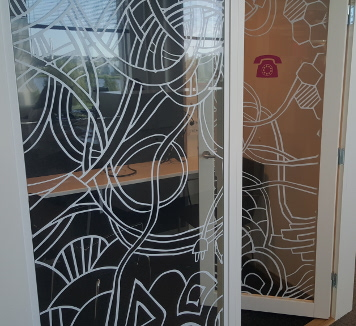

### Vain sijainti ja yhteiskäyttöisyys rajana...

Vapauskartta soveltuu mihin tahansa yhteiskäyttöiseen resurssiin, jolla
on sijainti.  Mutta voi olla vaikea kuvitella, mitä kaikkea tämä voisi
tarkoittaa... alla on muutamia ehdotuksia, mihin vapauskarttoja voi
käyttää.  Myös [käyttäjien kokemuksissa](kokemuksia) on muutamia
ideoita, mihin vapauskarttoja voisi käyttää. 

### Esimerkkikäyttökohteita

 

Missä pääsisin puhumaan rauhassa puhelimeen?  Kaikissa työtiloissa ei
ole erillisiä, selkeitä puhelinkoppeja, vaan sen sijaan
porrastasanteita, rauhallisia nurkkia ja muita.  Varsinkin puhelun
tullessa on hyvin kätevää, jos saa suoraan tietää, missä on lähin vapaa
hiljainen tila.

Jos puhelinkopit ovat suljettuja, saadaan erittäin tarkka varaustilanne
selville yhdistämällä tietoa oven kiinniolosta ja liikkeestä.
Neuvotteluhuoneita, vessoja ja suihkuja voi varata helposti samaan
tapaan.

 

Kahvitilat ovat usein pieniä ja niihin on ängetty paljon
yhteiskäyttöisiä palveluita ja laitteita.  Kun tarpeeksi moni seuraa
kahvitilan vapauskarttaa, ei tungosta synny eikä tarvitse odotella.

Tieto varaustilanteesta voidaan kerätä liikeantureilla ympäristöstä,
laitteiden liikkeestä, tai molemmista.

 

Eikö olisikin aika kätevää, jos näytöstä näkisi, kannattaako mennä
etsimään paikkaa tänne vai seuraavalle parkkipaikalle?  Ja jos tuolla on
vapaa paikka, missä se on?  Autojen paikallaolon voi tunnistaa
induktiosilmukalla, sähkösilmällä tai painoantureilla.  Järkevä
tekniikka riippuu paikasta.

 

Pyörille on tietysti yhtä lailla hyötyä kartasta, jossa näkyy vapaat
paikat, tai edes kartasta, jossa näkyy lähialueen pyöräparkit :)
Vapaiden pyöräpaikkojen automaattinen kartoitus on haastavampaa ja
saattaa vaatia esim. kuvantunnistusta.

 

Vau, tällä kertaa yhteisiä kuppeja on vielä jäljellä!  Olisinkohan
viitsinyt käydä erikseen katsomassa?

Kuppien varaustilanteen saa helposti mitatuksi hyllylle asetetuilla
painoantureilla (eli vaaoilla).  Tässä, kuten muissakin nopeasti
vapautuvissa ja taas varautuvissa resursseissa, on myös hyötyä
jatkopalveluista, kuten notifikaatioista, kun kuppeja on taas tarjolla,
tai varoituksista, kun ne alkavat loppua.

