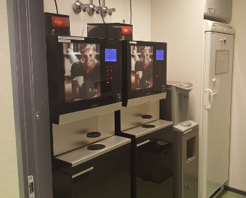
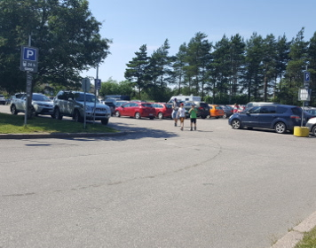
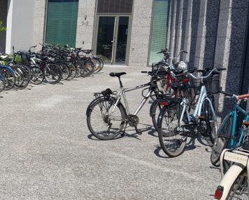
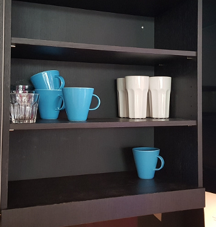

### Vain _X_ rajana...

Vapauskartta soveltuu mihin tahansa yhteiskäyttöiseen resurssiin, jolla
on sijainti.  Mutta voi olla vaikea kuvitella, mitä kaikkea tämä voisi
tarkoittaa... alla on muutamia ehdotuksia, mihin vapauskarttoja voi
käyttää.  Myös [käyttäjien kokemuksissa](kokemuksia) on muutamia
ideoita, mihin vapauskarttoja voisi käyttää. 

### Esimerkkikäyttökohteita

Kahvitilat ovat usein pieniä ja niihin on ängetty paljon
yhteiskäyttöisiä palveluita ja laitteita.  Kun tarpeeksi moni seuraa
kahvitilan vapauskarttaa, ei tungosta synny eikä tarvitse odotella.

Tieto varaustilanteesta voidaan kerätä liikeantureilla ympäristöstä,
laitteiden liikkeestä, tai molemmista.

Eikö olisikin aika kätevää, jos näytöstä näkisi, kannattaako mennä
etsimään paikkaa tänne vai seuraavalle parkkipaikalle?  Ja jos tuolla on
vapaa paikka, missä se on?  Autojen paikallaolon voi tunnistaa
induktiosilmukalla, sähkösilmällä tai painoantureilla.  Järkevä
tekniikka riippuu paikasta.

Pyörille on tietysti yhtä lailla hyötyä kartasta, jossa näkyy vapaat
paikat, tai edes kartasta, jossa näkyy lähialueen pyöräparkit :)
Vapaiden pyöräpaikkojen automaattinen kartoitus on haastavampaa ja
saattaa vaatia esim. kuvantunnistusta.

Vau, tällä kertaa yhteisiä kuppeja on vielä jäljellä!  Olisinkohan
viitsinyt käydä erikseen katsomassa?

Kuppien varaustilanteen saa helposti mitatuksi hyllylle asetetuilla
painoantureilla (eli vaaoilla).  Tässä, kuten muissakin nopeasti
vapautuvissa ja taas varautuvissa resursseissa, on myös hyötyä
jatkopalveluista, kuten notifikaatioista, kun kuppeja on taas tarjolla,
tai varoituksista, kun ne alkavat loppua.

