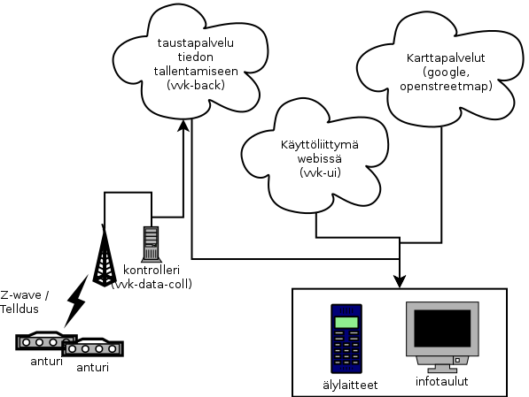
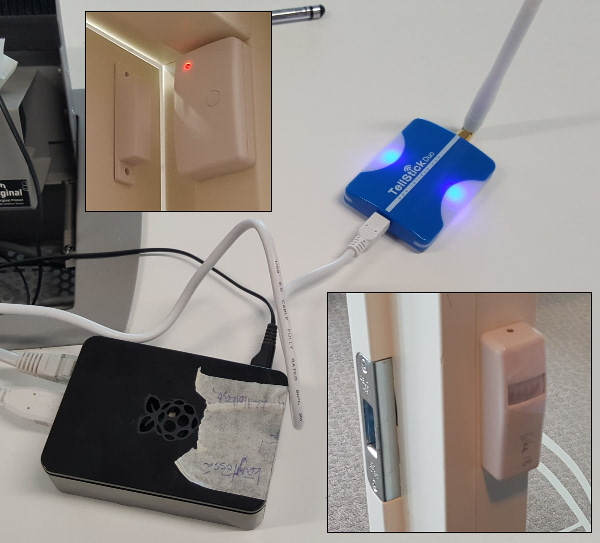

### Palvelun tekninen rakenne

[Tekninen
arkkitehtuuri](https://github.com/KoneidenKapinaAdele/vvk/blob/master/docs/arkkitehtuuri.md)
on kuvattu myös projektin Github-sivuilla.

Arkkitehtuuri koostuu neljästä osasta:

1. Dataa keräävät anturit lähettävät tapahtumia pilvipalvelimelle HTTP
   POST-komennoilla.
2. Pilvipalvelin tallentaa anturien tapahtumat, hallitsee datan luonnin
   ja haun käyttöoikeuksia ja tarjoaa käyttöliittymälle valmiiksi
   pureskeltua dataa.
3. Selainkäyttöliittymä näyttää tietoa anturien datan perusteella
4. Datan analyysi pureksii raakadataa ja löytää uusia, yllättäviä
   asioita

### Tiedonkeruun toteutus

Tilojen varaustilannetta seurataan yhdistelemällä tietoa liikeantureista
ja oven aukioloa seuraavista antureista.  Mikäli tilassa on ollut
liikettä, se pysyy varattuna niin kauan, kuin ovi on kiinni.

Piloteissa on käytetty kahta teknologiaa, Telldusin
[Tellstick-järjestelmää](http://www.telldus.se/products/tellstick) sekä
Z-wave.me:n [Razberry-tuotetta](https://www.z-wave.me/index.php?id=22).
Molemmat tarjoavat langattomien antureiden tiedot kohtuullisen hyvin
dokumentoiduilla, avoimilla rajapinnoilla ja molempien
ohjelmistokomponentit ovat myös avointa lähdekoodia.

Molemmat vastaanottimet on liitetty kontrollerina toimivaan [Raspberry
Pi-koneeseen](https://www.raspberrypi.org/), jonka asennus
anturikontrolleriksi on osittain
[automatisoitu](https://github.com/KoneidenKapinaAdele/vvk-data-collection/tree/master/rz-controller).
Adele on myös toteuttanut ohjelmistot tiedon keräämiseksi VVK:n
pilvipalveluun
[z-waysta](https://github.com/KoneidenKapinaAdele/vvk-data-collection/tree/master/razberry-client)
ja
[tellstickista](https://github.com/KoneidenKapinaAdele/vvk-data-collection/tree/master/telldus-client).

### Tietoa tallettava pilvipalvelu

[Pilvipalvelua](https://github.com/KoneidenKapinaAdele/vvk-back)
käytetään pelkästään APIen kautta, sillä ei ole omaa
www-käyttöliittymää.  Pilvipalvelu-backend on vastuussa datan keruusta
ja reaaliaikaisen tiedon tarjoamisesta käyttöliittymäkomponenteille.
Toteutusteknologiana on Java ja [Spring
boot](http://projects.spring.io/spring-boot/).

Taustalla toimiva tietokanta on
[PostgreSQL](https://www.postgresql.org/).

### Käyttöliittymä

VVK:n [käyttöliittymä](https://github.com/KoneidenKapinaAdele/vvk-ui/)
on toteutettu staattisilla www-sivuilla plain Javascriptina.  Se käyttää
[Leaflet-kirjastoa](http://leafletjs.com/) kartan esittämiseen ja
chartjs- ja momentjs-kirjastoja datan visualisointiin.  Käyttöliittymä
on suunniteltu toimimaan yhtä hyvin pöytäkoneissa ja älypuhelimissa.

### Aineiston analysointi

[Avoimien rajapintojen](avoindata) vuoksi aineistoa voi työstää
haluamillaan työkaluilla.  Omat data-analyysimme tehtiin
[R-kielellä](https://www.r-project.org/).

